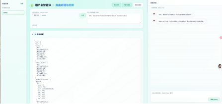
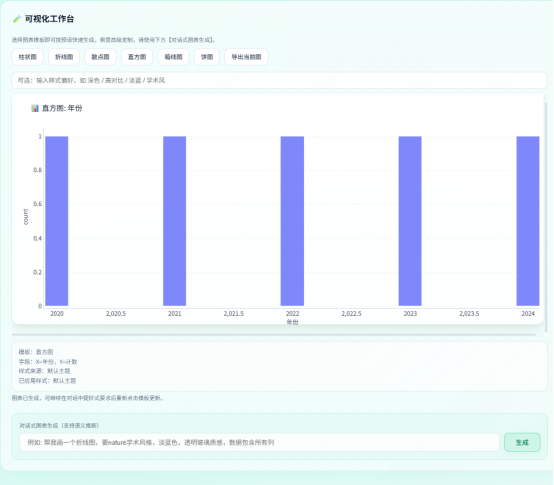
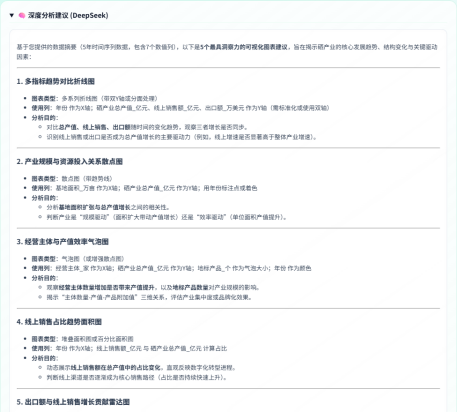
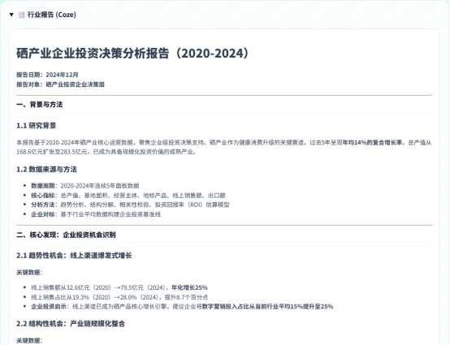
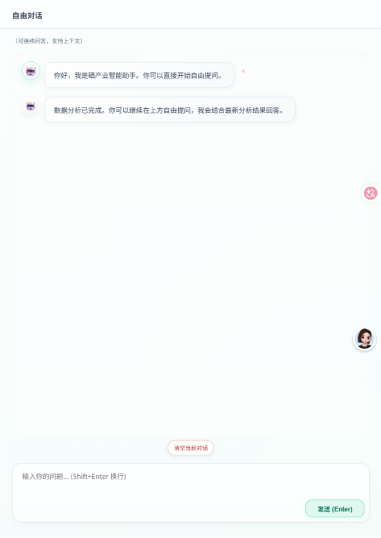

# 硒产业智能体（Se Industry Agent）

我们已经部署到服务器上了，可以通过在线网页访问[硒产业智能体](http://47.102.158.203/)

## 产品介绍

我们是高校团队研发的硒产业智能体，核心目标是帮助企业更快完成数据分析与经营洞察输出。

### 一、我们能做什么

1. 数据一键上传
支持上传一个或多个 CSV/Excel，自动合并分析，快速接入企业已有数据。

2. 自动生成可视化图表
系统自动形成关键图表，直观展示趋势、结构和变化。

3. 智能分析与建议
基于 DeepSeek 自动输出数据洞察，辅助企业识别问题与机会点。

4. 自动生成行业报告
基于 Coze 开发的智能体形成可直接用于内部汇报、项目汇报或客户沟通的专属行业分析报告。

### 二、对企业的核心价值

1. 提升效率
将原本耗时的人工分析与写报告流程，缩短到分钟级。

2. 降低门槛
不需要复杂技术背景，只需一句话，就能快速获得专业化分析结果，降低人工成本。

3. 支持决策
用“图表 + 洞察 + 报告”三位一体方式，提升决策依据的清晰度。

4. 易于扩展
可按企业业务场景定制指标、图表模板与报告结构。

### 三、适用场景

1. 经营复盘与月度分析
2. 市场与产销趋势研判
3. 招商展示与项目路演
4. 管理层汇报材料快速生成

一句话总结：我们帮助企业把“数据”快速变成“可看、可读、可决策”的业务成果。

### 产品展示

整体界面



可视化效果



大模型的深度分析



行业报告生成



继续与智能体进行自由对话



---

一个简单的一体化应用：上传数据 -> 自动生成可视化图表（Plotly） -> 用 DeepSeek 做洞察建议 -> 用 Coze 智能体生成行业报告。

说明：图表工作台中的“自定义改图”能力通过硅基流动 OpenAI 兼容接口调用多模态模型，默认使用 Qwen3.5-35B-A3B，可结合当前图像快照 + 用户指令生成新图。

## 安装依赖

```bash
pip install -r requirements.txt
```

## 环境变量

在同目录创建 `.env` 文件（可参考下面示例）。

- `COZE_API_TOKEN`: Coze API Token
- `COZE_BOT_ID`: 你的 Coze 机器人 ID（适合硒产业分析）
- `COZE_API_BASE` (可选): Coze API Base（默认中国站）
- `DEEPSEEK_API_KEY`: DeepSeek API Key
- `DEEPSEEK_API_BASE` (可选): DeepSeek API Base（默认 `https://api.deepseek.com/v1`）
- `DEEPSEEK_MODEL` (可选): 模型名（默认 `deepseek-chat`）
- `VL_API_KEY` (可选): 可视化改图模型密钥
- `VL_API_BASE` (可选): 可视化改图模型接口 Base（默认 `https://api.siliconflow.cn/v1`）
- `VL_MODEL` (可选): 可视化改图模型名（默认 `Qwen/Qwen3.5-35B-A3B`）
- `VL_ENABLE_THINKING` (可选): 是否启用思考模式（默认 `false`，即即时模式）
- `VOLC_WEBSEARCH_API_KEY`: 火山联网搜索 API Key（Bearer）
- `VOLC_WEBSEARCH_API_URL` (可选): 联网搜索接口地址（默认 `https://open.feedcoopapi.com/search_api/web_search`）
- `VOLC_WEBSEARCH_SEARCH_TYPE` (可选): 搜索类型（默认 `web_summary`）
- `VOLC_WEBSEARCH_COUNT` (可选): 每次联网搜索条数（默认 `5`）
- `VOLC_WEBSEARCH_TIMEOUT` (可选): 联网搜索超时秒数（默认 `25`）

`.env` 示例：

```
COZE_API_TOKEN=xxxxxxxx
COZE_BOT_ID=xxxxxxxx
COZE_USER_ID=local_user
DEEPSEEK_API_KEY=ds_xxxxxxxx
DEEPSEEK_API_BASE=https://api.deepseek.com/v1
DEEPSEEK_MODEL=deepseek-chat
VL_API_KEY=your_siliconflow_api_key
VL_API_BASE=https://api.siliconflow.cn/v1
VL_MODEL=Qwen/Qwen3.5-35B-A3B
VL_ENABLE_THINKING=false
VOLC_WEBSEARCH_API_KEY=your_api_key
VOLC_WEBSEARCH_API_URL=https://open.feedcoopapi.com/search_api/web_search
VOLC_WEBSEARCH_SEARCH_TYPE=web_summary
VOLC_WEBSEARCH_COUNT=your_number
VOLC_WEBSEARCH_TIMEOUT=25
```

## 本地运行（Windows）

```bash
# 启动 API 服务（FastAPI）
python -m uvicorn src.server:app --reload --port 8000
```

打开浏览器访问 `http://localhost:8000/`，上传 CSV 或 Excel 文件，即可看到图表与两段分析文本（DeepSeek、Coze）。

## 服务器部署（Docker + 宝塔，简化版）

适用场景：云服务器（如阿里云轻量应用服务器）+ 宝塔面板 + Docker。

### 1) 前置检查

- 已安装宝塔面板，并可正常打开
- 已在服务器创建站点（可用服务器 IP 或域名）
- 防火墙已放行常用端口（如 `80`、`443`、`8888`）
- 项目代码已上传到服务器目录（示例：`/www/wwwroot/<your-site>/xi_agent/`）

### 2) 安装 Docker（CentOS 7）

```bash
yum remove -y docker docker-client docker-client-latest docker-common docker-latest docker-latest-logrotate docker-logrotate docker-engine
yum install -y yum-utils device-mapper-persistent-data lvm2
yum-config-manager --add-repo https://mirrors.aliyun.com/docker-ce/linux/centos/docker-ce.repo
yum install -y docker-ce docker-ce-cli containerd.io
systemctl start docker
systemctl enable docker
docker --version
```

### 3) 构建镜像

项目根目录已有 `dockerfile`，执行：

```bash
cd /www/wwwroot/<your-site>/xi_agent
docker build -f dockerfile -t xi_agent:latest .
```

### 4) 启动容器（生产）

```bash
cd /www/wwwroot/<your-site>/xi_agent
docker stop xi_agent || true
docker rm xi_agent || true
docker run -d \
	--name xi_agent \
	-p 8000:8000 \
	--env-file .env \
	--restart=always \
	xi_agent:latest
```

说明：

- 生产环境不要使用 `--reload`
- 服务必须绑定 `0.0.0.0`（镜像内已配置）

### 5) 宝塔反向代理

在宝塔网站设置中添加反向代理：

- 目标 URL：`http://127.0.0.1:8000`
- 发送域名：`$host`

配置完成后，访问你的站点地址（IP 或域名）即可。

## 版本更新（仅 4 步）

后续更新无需重复配环境，只做代码和容器更新：

```bash
cd /www/wwwroot/<your-site>/xi_agent
docker stop xi_agent || true
docker rm xi_agent || true
docker build -f dockerfile -t xi_agent:latest .
docker run -d --name xi_agent -p 8000:8000 --env-file .env --restart=always xi_agent:latest
```

## 一键更新脚本（可选）

在项目目录创建 `update.sh`：

```bash
#!/bin/bash
set -e

cd /www/wwwroot/<your-site>/xi_agent
docker stop xi_agent || true
docker rm xi_agent || true
docker build -f dockerfile -t xi_agent:latest .
docker run -d --name xi_agent -p 8000:8000 --env-file .env --restart=always xi_agent:latest

echo "Deploy finished."
```

赋予执行权限：
```bash
chmod +x update.sh
```
后面就只用执行
```
./update.sh
```
## 常用排查命令

```bash
docker ps
docker logs -f xi_agent
docker restart xi_agent
docker exec -it xi_agent /bin/bash
```

## 目录结构

- `src/server.py`: FastAPI 服务，汇总各项能力
- `src/charting.py`: 数据读取与基础图表生成（Plotly）
- `src/deepseek_client.py`: 调用 DeepSeek（OpenAI 兼容 API）
- `src/coze_service.py`: 调用 Coze 生成行业报告
- `src/frontend/`: 简单前端（Plotly.js + 原生 JS）
- `src/chat_cli.py`: 现有 Coze CLI 示例（可单独运行）

## 说明

- 若 DeepSeek 或 Coze 环境变量未配置，返回中会包含相应的不可用提示。
- 图表为自动生成的基础视图；可根据领域特征扩展成更专业的可视化与指标体系。
- 如果需要 React/Next.js 前端，也可以把接口保持不变，前端另建工程对接即可。
